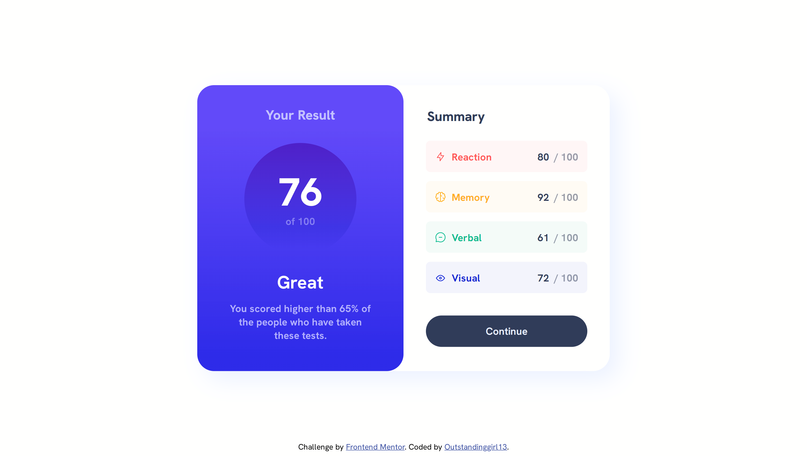

# Frontend Mentor - Results summary component solution

This is a solution to the [Results summary component challenge on Frontend Mentor](https://www.frontendmentor.io/challenges/results-summary-component-CE_K6s0maV). Frontend Mentor challenges help you improve your coding skills by building realistic projects. 

## Table of contents

- [Overview](#overview)
  - [The challenge](#the-challenge)
  - [Screenshot](#screenshot)
  - [Links](#links)
- [My process](#my-process)
  - [Built with](#built-with)
  - [What I learned](#what-i-learned)
  - [Useful resources](#useful-resources)
- [Author](#author)


## Overview

### The challenge

Users should be able to:

- View the optimal layout for the interface depending on their device's screen size
- See hover and focus states for all interactive elements on the page
- **Bonus**: Use the local JSON data to dynamically populate the content

### Screenshot



### Links

- Solution URL: [Add solution URL here](https://your-solution-url.com)
- Live Site URL: [GitHub Pages](https://outstandinggirl13.github.io/results-summary-component-main/)

## My process

### Built with

- Semantic HTML5 markup
- CSS custom properties
- Flexbox
- JS

### What I learned

Throughout this project, I had the chance to acquire several important skills. I learned the following features:

1. To center all the content of the `<body>` on the screen using Flexbox, I implemented the following code (an experienced learner from Frontend Mentor shared this tip with me — many thanks if you're reading this):

```css 
    body { 
      display: flex;
      flex-direction: column;
      justify-content: center;
      align-items: center; 
      min-height: 100vh; 
    }
```

2. To center text horizontally within a block-level element, you simply need to apply a single CSS property to the block-level element, in this case to `<h1>` element:

```css
    h1 {
      text-align: center;
    }
```

3. To vertically align elements inside an `<li>` item, one effective method is to change the display property of all elements to inline and then apply `vertical-align: middle` to each of them:

```css
    .component-summary__blocks img,
    .component-summary__blocks p {
        display: inline;
        vertical-align: middle;
    }
```
Only inline elements can be vertically aligned in their context using `vertical-align: middle`. The context refers to the height of the text line they occupy.

4. When positioning elements inside a container (in this case `<li>` item), you can use Flexbox to ensure that the icon image and block name are aligned to the left, while the score is positioned to the right.

```css
    .component-summary__blocks li {
        display: flex;
        justify-content: space-between;
    }
```
To use this approach correctly, you need to wrap the elements on the left, which include the image and paragraph, in one `<div>`, and the elements on the right, which consist of two paragraphs displaying the score, in another `<div>`. This ensures that space is evenly distributed between the two containers within the `<li>` item that hold those elements.

5. You can use a JSON with data to dynamically update the content on the page. The goal was to generate the following HTML code using JavaScript and data from the *data.json* file:

```html
        <li class="component-summary__reaction-block">
          <div class="component-summary__reaction">
            
            <p class="block-name">Reaction</p>
          </div>
          <div>
            <p>80</p>
            <p class="score-max"> / 100</p>
          </div>
        </li>
        <li class="component-summary__memory-block">
          <div class="component-summary__memory">
            
            <p class="block-name">Memory</p>
          </div>
          <div>
            <p>92</p>
            <p class="score-max"> / 100</p>
          </div>
        </li>
        <li class="component-summary__verbal-block">
          <div class="component-summary__verbal">
            
            <p class="block-name">Verbal</p>
          </div>
          <div>
            <p>61</p>
            <p class="score-max"> / 100</p>
          </div>
        </li>
        <li class="component-summary__visual-block">
          <div class="component-summary__visual">
            
            <p class="block-name">Visual</p>
          </div>
          <div>
            <p>72</p>
            <p class="score-max"> / 100</p>
          </div>
        </li>
```

One of the issues I encountered was an error while testing the following JavaScript code:

```js
    fetch("data.json")
      .then(response => response.json())
      .then(json => {/*code snippet*/})
```
It turned out that I cannot fetch data directly from the local *.json* file and view it in my browser. One solution to this issue is to install a web server on your local PC, which is what I did (I installed the Live Server extension by Ritwick Dey in VSCode and used it). 

At the end of this README.md, you will find a collection of resources that helped me understand what JSON is and how to use it.

The provided *.json* file was structured as an array, so I iterated over its elements using the `forEach()` method. Each element is an object containing three key-value pairs that hold information about the category, score, and icon. I utilized this data to create the structure of `<li>` elements in the *index.html* for each object.

Essentially, the development flow involved creating a new element, assigning a class to it so that the styles defined in the styles.css file would be applied, and, if necessary, modifying the text content or adding attributes. Then, the new elements were gradually added to the index.html file.

This is my first implemented script that dynamically loads data via JSON, and to be honest, it feels cumbersome. I will be looking for ways to improve it.

### Useful resources

- [Learn JSON in 25 Minutes | Complete JSON Crash Course | JSON Tutorial for Beginners](https://www.youtube.com/watch?v=6OhMbf2v_jI) - A nice introductory video that explains JSON for those new to the topic.
- [JSON Placeholder](https://jsonplaceholder.typicode.com/) - A handy tool for experimenting with JSON.
- ["Cross origin requests are only supported for HTTP." error](https://stackoverflow.com/questions/10752055/cross-origin-requests-are-only-supported-for-http-error-when-loading-a-local) - How to manage a fetching error while loading a *.json* file.
- [Working with JSON - MDN](https://developer.mozilla.org/en-US/docs/Learn/JavaScript/Objects/JSON)

## Author

- Website - [Outstandinggirl13](https://github.com/Outstandinggirl13)
- Frontend Mentor - [@Outstandinggirl13](https://www.frontendmentor.io/profile/Outstandinggirl13)
